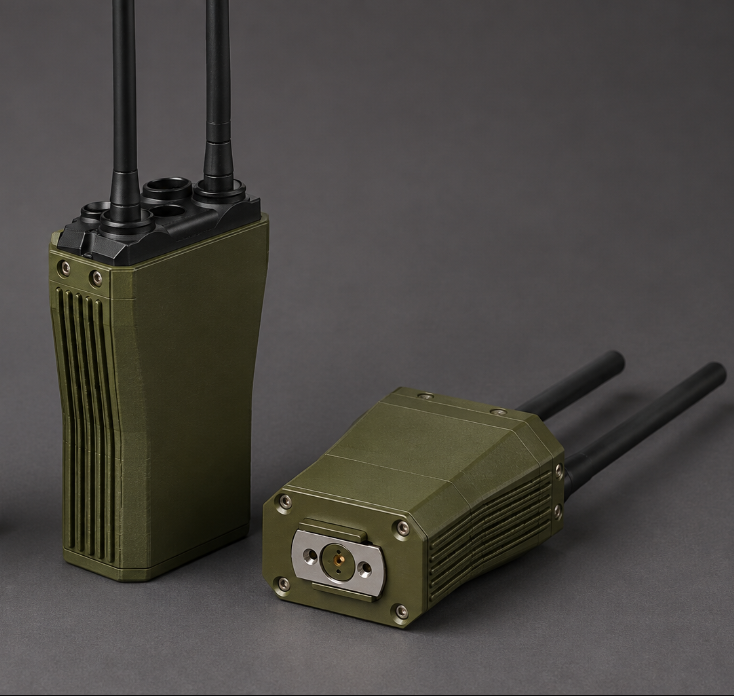
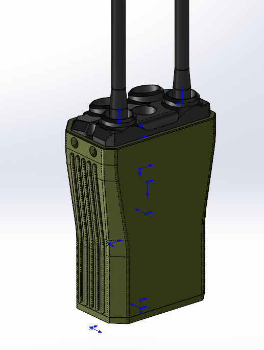
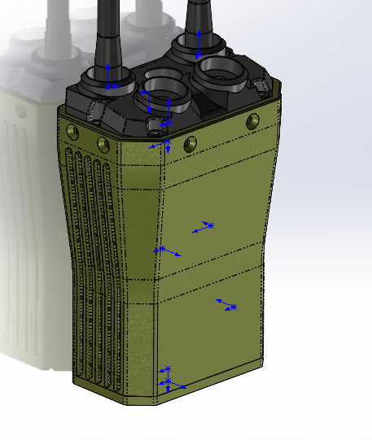
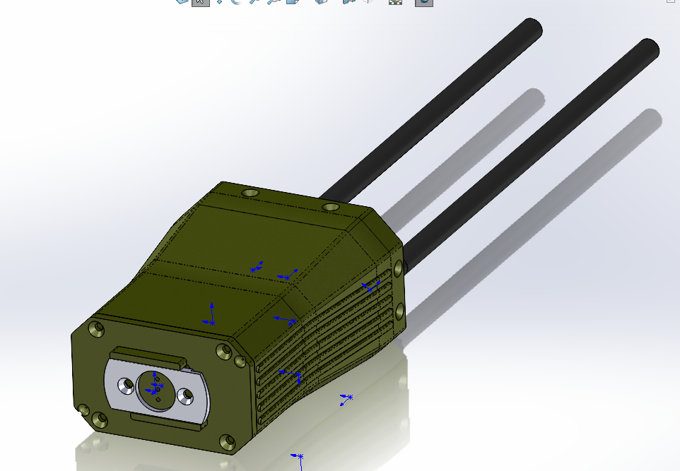

# First Generation V2

More compact Pi 4/Wio prototype with the first integrated removable twist-lock battery.

## Visual overview

| Front render | Top render |
|---|---|
|  |  |

| Twist-lock battery module |
|---|
|  |

## Hardware

| Part | Notes |
|---|---|
| Raspberry Pi 4 | Main computer |
| WM1302 Pi HAT | Mini-PCIe adapter path |
| Seeed Studio Wio WM6108 | Wi-Fi HaLow module |
| RAK WisMesh 1W kit | Separate Meshtastic / LoRa subsystem |
| 5 V buck converter | Main Pi/radio power rail |
| Removable twist-lock battery | First integrated twist-lock version |
| Pogo-pin connection | Battery-to-radio electrical connection |

## Battery

Removable twist-lock battery system.

## Files

- `3MF/` print-ready files
- `STL/` individual printable parts
- `step/` STEP exports
- `Solidworks 2023/` native files
- `Solidworks 2025/` native files
