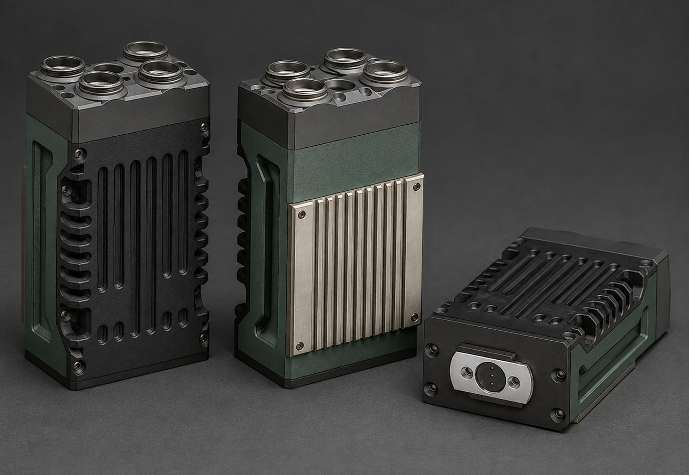
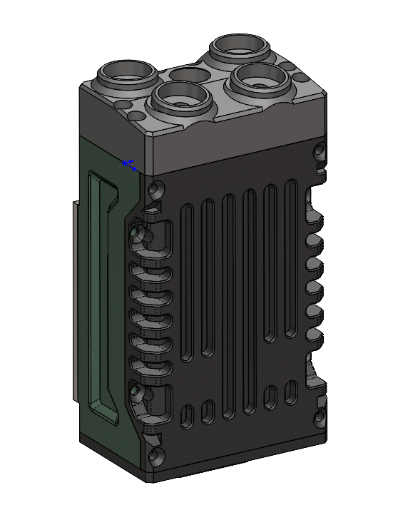
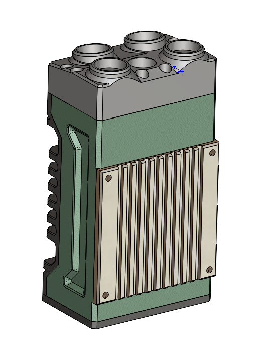
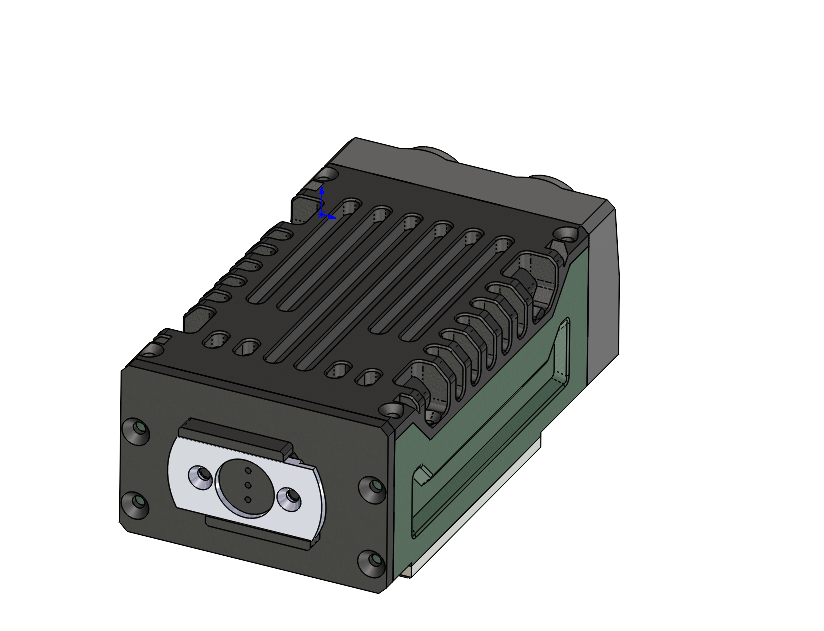

# First Generation V3

Most complete old Raspberry Pi 4 prototype.

## Visual overview

AI render visualizing the V3 design.

| SolidWorks front / side screenshot | SolidWorks rear heatsink screenshot |
|---|---|
|  |  |

| SolidWorks twist-lock battery module screenshot |
|---|
|  |

## Hardware

| Part | Notes |
|---|---|
| Raspberry Pi 4 | Main computer |
| WM1302 Pi HAT | Mini-PCIe adapter path |
| Seeed Studio Wio WM6108 | Wi-Fi HaLow module |
| RAK WisMesh 1W kit | Separate Meshtastic / LoRa subsystem |

## Battery

Revised removable twist-lock battery system.

## Files

- `3MF/` print-ready files
- `STEP/` STEP exports
- `Solidworks 2023/` native files
- `Solidworks 2025/` native files
- [`README BEFORE BUILD.md`](./README%20BEFORE%20BUILD.md) build notes
