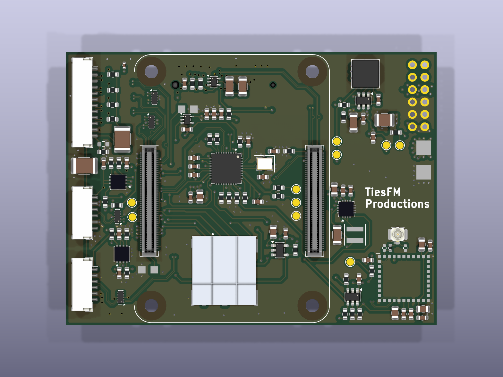

# CM4 MANET carrier board

KiCad source project for the experimental Raspberry Pi Compute Module 4 MANET carrier board.

> [!WARNING]
> **Development design — not released for fabrication.** The current production review still lists unresolved ERC, GND-connectivity, SI/PI, mechanical and manufacturing-output items. Read [`docs/PRODUCTIECHECK-2026-09-19.md`](./docs/PRODUCTIECHECK-2026-09-19.md) before using the design.

## Hardware target

The carrier combines:

- Raspberry Pi Compute Module 4;
- M.2 E-key Wi-Fi/MANET radio interface;
- onboard Morse Micro MM8108 HaLow option;
- USB2514B USB hub and two external USB interfaces;
- microSD, Ethernet, power regulation and service interfaces;
- Pololu D42V55F5 5 V regulator module.

## Open the project

1. Install **KiCad 10** or newer.
2. Download or clone this complete folder so the local libraries and 3D models remain beside the project.
3. Open [`CM4_MANET.kicad_pro`](./CM4_MANET.kicad_pro).
4. KiCad should resolve the bundled libraries through [`sym-lib-table`](./sym-lib-table) and [`fp-lib-table`](./fp-lib-table).

The project uses KiCad's standard symbol, footprint and 3D libraries in addition to the bundled local files.

## Included files

| Path | Purpose |
|---|---|
| `CM4_MANET.kicad_pro` | KiCad project settings and design rules |
| `CM4_MANET.kicad_sch` | Hierarchical top-level schematic |
| `01_…16_*.kicad_sch` | Schematic sheets |
| `CM4_MANET.kicad_pcb` | Routed six-layer PCB |
| `MANET.kicad_sym` | Bundled project symbols |
| `MANET.pretty/` | Bundled project footprints |
| `G2401CE.kicad_sym` | Ethernet magnetics symbol |
| `G2401CE.pretty/` | Ethernet magnetics footprint |
| `models/`, `G2401CE.3dshapes/` | Local 3D models referenced by the board |
| `docs/PLAN-EN-STATUS.md` | Canonical design context and decisions |
| `docs/PRODUCTIECHECK-2026-09-19.md` | Latest production-readiness review and correction checklist |
| `DATASHEET-INDEX-V0.11.md` | Component/source index |

## Verified source snapshot

The upload was prepared from the latest saved and synchronized project snapshot available on 19 September 2026.

| File | SHA-256 |
|---|---|
| `CM4_MANET.kicad_pro` | `29031d407538b3dbcb6472aa7c64797e4d6ba71f1556e2ef84310c6bf45d1d5d` |
| `CM4_MANET.kicad_sch` | `d8fc85620186ded0c0d289be1d9e3905773756102ce121de9318bc477c56a758` |
| `CM4_MANET.kicad_pcb` | `218439d0e7e71eeba17b0bce05ddc644826dbbb2ce876aa322ecba9a2478592e` |

## Deliberately not included

The following local files were excluded because they are stale, generated, machine-specific or not needed to inspect/edit the source:

- old Gerbers and drill files;
- old BOM/CPL quotation exports;
- old STEP assembly export;
- KiCad lock/preferences files;
- temporary validation output;
- `.history`, caches and backups;
- local copies of third-party datasheets.

Generate new fabrication files only after the correction checklist is closed and the design has passed a fresh production review.

## License

This folder follows the repository license: [CC BY-NC-SA 4.0](../../LICENSE).
