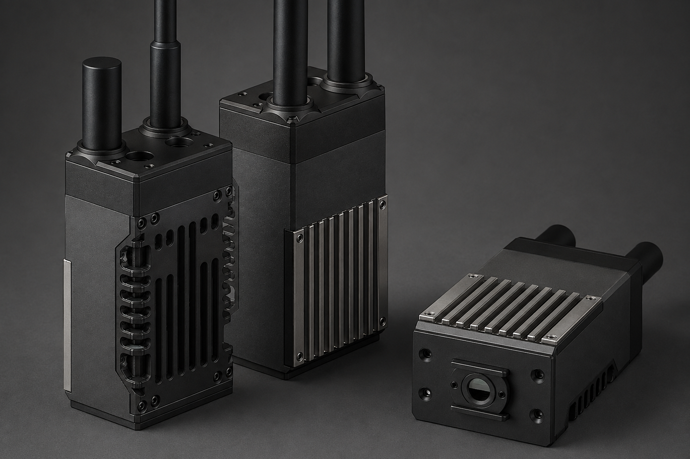
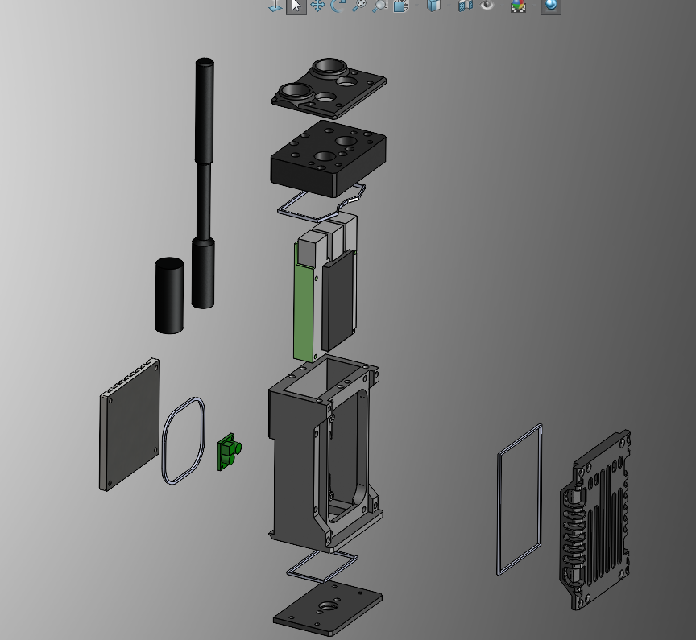
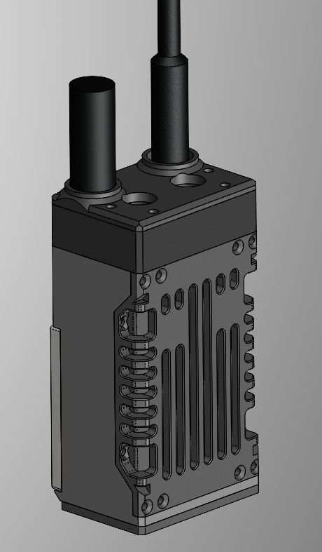
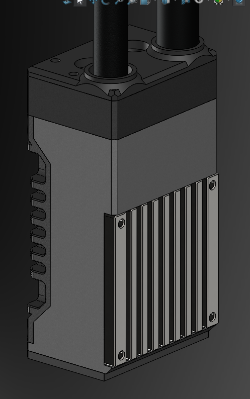
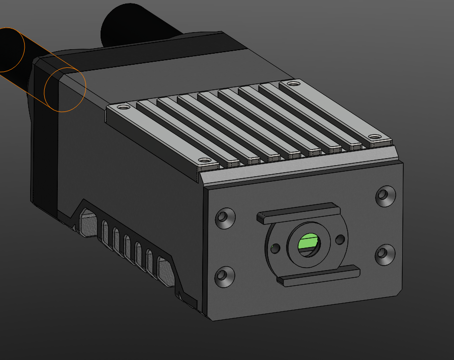

# P4-Wio

Complete working Raspberry Pi 4 based HaLow-only radio enclosure using the Seeed Studio Wio WM6108 module.

## Status

First complete named build target. The physical build has been assembled and works; 3MF, STEP, SolidWorks 2025 files and images are included.

## Images

<table>
  <tr>
    <td width="50%">
       
      Exploded assembly view.
    </td>
    <td width="50%">
       
      Front cooling side.
    </td>
  </tr>
  <tr>
    <td width="50%">
       
      Rear heatsink side.
    </td>
    <td width="50%">
       
      Removable battery module view.
    </td>
  </tr>
</table>

## Hardware target

| Part | Role |
|---|---|
| Raspberry Pi 4 | Main computer for HaLow/IP networking |
| WM1302 Pi HAT style adapter | Mini-PCIe adapter path for the HaLow module |
| Seeed Studio Wio WM6108 | Wi-Fi HaLow radio module |

This is a **HaLow-only** build. It does not include the separate LoRa/Meshtastic subsystem from the older V1–V3 prototypes.

## Files

| Folder | Contents |
|---|---|
| [`3MF`](./3MF/) | Print-ready project file |
| [`STEP`](./STEP/) | Full assembly and individual CAD exchange files |
| [`SolidWorks-2025`](./SolidWorks-2025/) | Native SolidWorks 2025 source archive |
| [`STL`](./STL/) | Reserved for individual STL exports |
| [`images`](./images/) | Photos, renders and diagrams for this build |

## Included CAD exports

| File | Purpose |
|---|---|
| [`P4-WIO.3MF`](./3MF/P4-WIO.3MF) | Print/project file |
| [`P4-WIO.STEP`](./STEP/P4-WIO.STEP) | Full assembly STEP export |
| [`raspberry_pi4_wm6108_halow_stack.STEP`](./STEP/raspberry_pi4_wm6108_halow_stack.STEP) | Pi 4 + WM6108 HaLow stack reference |
| [`enclosure_main_chassis.STEP`](./STEP/enclosure_main_chassis.STEP) | Main enclosure body |
| [`enclosure_front_cover.STEP`](./STEP/enclosure_front_cover.STEP) | Front cover |
| [`enclosure_top_cover.STEP`](./STEP/enclosure_top_cover.STEP) | Top cover |
| [`mount_twist_lock_magnetic_radio.STEP`](./STEP/mount_twist_lock_magnetic_radio.STEP) | Battery/radio interface mount |
| [`heatsink_external_70x70x3-6mm.STEP`](./STEP/heatsink_external_70x70x3-6mm.STEP) | External heatsink reference |
| [`pololu_buck_converter.STEP`](./STEP/pololu_buck_converter.STEP) | Buck regulator reference |
| [`P4-WIO.zip`](./SolidWorks-2025/P4-WIO.zip) | SolidWorks 2025 source archive |

## Notes

- Upload improved P4-Wio SolidWorks, 3MF and STEP files into the matching folders above.
- Download the complete folder before opening the SolidWorks assembly.
- The STEP files are provided for inspection, remixing and non-SolidWorks workflows.
- The `STL` folder is reserved for later individual printable exports.
- This is an open-source DIY hardware build. Verify tolerances, wiring, polarity, cooling, antenna fit and power setup for your own parts before applying power.
