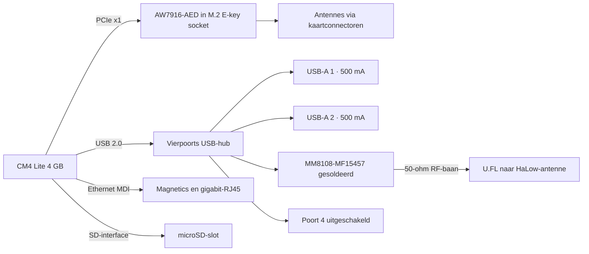
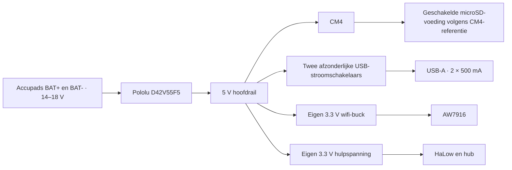

# CM4 MANET — systeem- en componentinventarisatie

Vervolg: [schemavoorbereiding v0.3](CM4-MANET-schemavoorbereiding-v0.3.md). Let op de nieuwe M.2-contactstroomcontrole en de voorkeur voor een 2 A-hulprail; componentkandidaten in deze v0.2 zijn nog niet definitief.

Versie 0.2 • 9 september 2026 • Voorlopig ontwerp, niet bestellen op basis van deze lijst.

Dit document is het vertrekpunt voor het schema in KiCad. Een component met status **kandidaat** is technisch kansrijk, maar nog niet volledig gecontroleerd op schakeling, footprint, thermiek en inkoop. **Open** betekent dat een exact bestelnummer nog geselecteerd moet worden. Dit is geen productie-BOM: aantallen passieve onderdelen en referentienummers volgen uit het schema.

## 1. Wat we bouwen

Een eigen carrier voor de reeds gekochte CM4 Lite 4 GB zonder wifi. Twee radio's: AW7916-AED via PCIe en gesoldeerde MM8108-MF15457 via interne USB. Twee externe USB-A 2.0-poorten van elk 500 mA en één gigabit-RJ45 komen op dezelfde korte zijde. microSD dient als opslag. Geen HDMI, GPIO-header of extra externe data-aansluitingen.

De accu levert 14–18 V via twee soldeerpads naar VIN/GND van een direct gemonteerde Pololu D42V55F5. CM4 boven, AW7916 onder. Streefmaat 85 × 56 mm inclusief connectorbehuizingen, exclusief aangesloten kabelstekkers. Totale hoogte maximaal 40 mm, liefst lager. De gebruiker ontwerpt het koellichaam rond de PCB. Antennes worden door eindgebruikers gekozen; het ontwerp documenteert de benodigde band en connectoren. Landinstelling via software; module-, firmware- en boardconfiguratie moeten daarbij passen.

Budgetaanpak: standaardonderdelen en zo weinig mogelijk verschillende componenttypen. Vier koperlagen als startpunt. Vijf prototypes uitsluitend als rekenbasis, geen vastgelegde bestelling. Geen definitieve prijs zonder BOM en JLCPCB-offerte.

## 2. Blokdiagram — dataverbindingen

De USB-hub verdeelt één verbinding over drie apparaten. Beide externe poorten en HaLow delen dus de USB 2.0-bandbreedte; 480 Mbit/s is de nominale bussnelheid, geen gegarandeerde netto snelheid per poort. De AW7916 en Ethernet gebruiken deze USB-bandbreedte niet. Zie [USB-hubdocumentatie](https://www.microchip.com/en-us/product/USB2514B) en [CM4-datasheet](https://datasheets.raspberrypi.com/cm4/cm4-datasheet.pdf).

## 3. Blokdiagram — voeding

De aparte wifi-regelaar voorkomt dat de AW7916 afhankelijk is van de beperkte CM4-3,3 V-uitgang. Externe 3,3 V-rails worden niet rechtstreeks met de CM4-voedingsuitgangen verbonden. Enable/reset, SD-voeding en terugvoeding via signaalpinnen worden in het schema afzonderlijk gecontroleerd.

## 4. Componentinventarisatie

| Functie | Aantal | Onderdeel / selectie | Status | Nog controleren |
|---|---:|---|---|---|
| Processor | 1 | CM4 Lite 4 GB zonder wifi | Vast; al gekocht | Exact label/SKU bij assemblage verifiëren |
| CM4-connectoren | 2 | Hirose DF40C-100DS-0.4V-familie | Kandidaat, CM4-referentie | Bestelsuffix, connectorhoogte en footprint |
| Wifi-kaart | 1 | AsiaRF AW7916-AED | Vast model | Nieuwste pinout, mechanische tekening, antenneconnectortype |
| Wifi-socket | 1 | M.2 E-key socket passend op A/E-key-kaart | Open | Stroomcapaciteit, alle 3,3 V-contacten, plaatsingshoogte en kaartmontage |
| Wifi-bevestiging | 1 set | Schroef/standoff passend op AW7916 | Open | Geen standaard 2230-kaartmaat veronderstellen |
| HaLow | 1 | Morse Micro MM8108-MF15457 | Vast model, inkoop open | USB-reference, opstart, RF-layout, firmware/BCF en assemblage |
| HaLow-antenneconnector | 1 | Hirose U.FL-R-SMT-1-familie | Kandidaat | Suffix en footprint; pigtailruimte |
| USB-hub | 1 | Microchip USB2514B-AEZC-TR | Kandidaat | Voedingsconfiguratie, reset, straps, niet-verwijderbare interne poort |
| Hubklok | 1 set | 24 MHz kristal en belastingscondensatoren volgens hubdatasheet | Open | ESR, belasting, tolerantie en layout |
| Hubconfiguratie | 0–1 | Configuratie-EEPROM, indien straps onvoldoende zijn | Open/optioneel | Self-powered, poort 3 intern en poort 4 uit; EEPROM weglaten alleen als configuratie klopt |
| USB-power | 2 | TI TPS2553, exacte packagevariant later | Kandidaat | 500 mA belasting toelaten bij toleranties; foutsignaal naar hub; inrush |
| USB-connector | 1 dubbel | Gestapelde USB-A 2.0, horizontaal | Open | Afmetingen, through-hole-pennen en botsingen met onderzijde |
| USB-ESD | 2 groepen | Lage-capaciteit ESD-bescherming | Open | USB 2.0 geschiktheid, capaciteit en plaatsing |
| Ethernet | 1 | Gigabit-RJ45 met geschikte 1:1 magnetics | Open | CM4-PHY-referentie, middenaftakkingen, LEDs en afmetingen; geen willekeurige 100-Mbit-magjack |
| Ethernetbescherming | 1 groep | ESD/terminatie volgens CM4-referentie en gekozen magjack | Open | PHY-kant versus kabelzijde, shield-koppeling |
| microSD | 1 | Molex 5033981892 | Kandidaat | Push-push, kaartdetectie, toegang en economische JLCPCB-alternatieven |
| microSD-voeding | 1 groep | Schakelaar/FET volgens CM4 SD_PWR_ON-referentie | Open | SD-spanning, reset en voedingstiming |
| SD-bescherming | 1 groep | ESD en eventuele serieweerstanden | Open | Capaciteit, signaalkwaliteit en referentieontwerp |
| Hoofdvoeding | 1 | Pololu D42V55F5, product 5571 | Vast model | Vermogen bij 14–18 V, soldeerpennen, warmte en mechanische ondersteuning |
| Wifi-buck | 1 | TI TPS565201DDCR, 5 A IC | Kandidaat | 5 V → 3,3 V bij 3 A, stabiliteit, spoel, condensatoren en thermiek; 5 A IC-rating is geen gegarandeerde boardcapaciteit |
| Wifi-buck passief | 1 groep | Vermogensspoel, input/output-MLCC, feedback, bootstrap | Open | Waarden berekenen uit datasheet; verzadigingsstroom en DC-bias van condensatoren |
| Hulpspanning | 1 | 3,3 V / 1 A buck; TI TPS62162 als kandidaat | Kandidaat | HaLow + hub werkelijke belasting, ripple en startup; alternatief indien te duur |
| HaLow-ondersteuning | 1 groep | Reset/bootstraps, USB-netwerk, ontkoppeling volgens module-referentie | Open | VDD_USB niet als 5 V-VBUS behandelen; exacte pinvoedingen controleren |
| Accupads | 2 | Grote soldeerpads BAT+ en BAT− | Vast functie | Naar Pololu VIN en GND; voldoende koper en trekontlasting in kast |
| Ingangsbeveiliging | 1 groep | Zekering/transiëntmaatregelen na accu-interfacecontrole | Open | Pololu heeft reeds ompoolbeveiliging; aanvullende componenten gericht kiezen |
| Ontkoppeling en bulk | meerdere | MLCC en eventueel bulkcondensator | Open | Railbelasting, spanningsrating, DC-bias en inschakelstroom |
| Testpunten | 1 set | 5 V, 3,3 V rails, GND, UART, reset/boot | Vast functie | Alleen pads; geen extra externe gebruikerspoort |
| Bevestiging | 1 set | Carrier- en CM4-steunen | Open | Gaten botsen niet met wifi-kaart/Pololu; geen Pi4-gatenpatroon toegezegd |

### Fabrikantbronnen voor kandidaten

- [Hirose DF40C-100DS-0.4V](https://www.hirose.com/en/product/p/CL0684-4033-4-58)
- [Hirose U.FL-R-SMT-1](https://www.hirose.com/en/product/p/CL0331-0472-2-60)
- [Molex microSD](https://www.molex.com/en-us/products/part-detail/5033981892)
- [Microchip USB2514B](https://www.microchip.com/en-us/product/USB2514B)
- [TI TPS2553](https://www.ti.com/product/TPS2553)
- [TI TPS565201](https://www.ti.com/product/TPS565201)
- [TI TPS62162](https://www.ti.com/product/TPS62162)

De TPS565201 wordt uitsluitend achter de 5 V-Pololu aangesloten: zijn 17 V maximale bedrijfsingang is niet geschikt voor directe aansluiting op onze accu tot 18 V.

## 5. Eerste vermogensbudget

Dit is een ruime **ontwerpreservering**, geen voorspelling van normaal verbruik en geen bewezen maximum. CM4/SD en logica moeten nog worden verfijnd. De HaLow-datasheet geeft bijvoorbeeld bij een beschreven TX-conditie circa 332 mA voor VBAT + VBAT_TX; onze reservering is bewust groter en omvat ruimte voor bijkomende belasting. Zie [MM8108-datasheet, hoofdstuk 4.4](https://www.morsemicro.com/resources/datasheets/modules/MM8108-MF15457_Data_Sheet.pdf).

| Verbruiker | Aangenomen belasting | Vermogen uit 5 V |
|---|---|---:|
| CM4 inclusief Ethernet-PHY en microSD | 2 A bij 5 V gereserveerd; nog geen gemeten maximum | 10,00 W |
| AW7916 | Fabrikant maximaal 9 W; wifi-buck op aangenomen 90% rendement | 10,00 W |
| HaLow | 0,60 A bij 3,3 V gereserveerd; buck 90% | 2,20 W |
| Hub en overige carrierlogica/verliezen | Aparte voorlopige reservering | 1,50 W |
| USB extern | 2 × 0,50 A bij 5 V | 5,00 W |
| **Totaal reservering** | | **28,70 W = 5,74 A bij 5 V** |
| **Met 15% extra systeemreserve** | | **33,01 W = 6,60 A bij 5 V** |

Formules: buck-ingangsvermogen = uitgangsvermogen / rendement; 5 V-stroom = totaalvermogen / 5. De wifi-regelaar moet minimaal de aanbevolen 3,3 V / 3 A leveren. Een test met volle 3 A wifi-rail betekent 9,9 W uitgang en dus 11 W ingang bij 90%: het bovenstaande totaal stijgt dan naar 29,70 W. [AsiaRF](https://asiarf.com/product/wi-fi-6e-m-2-ae-key-module-mt7916-aw7916-aed/)

**Conclusie:** de gekozen Pololu blijft uitgangspunt, maar ruime reserve is nog niet bewezen. De 6 A-benaming alleen is onvoldoende; Pololu koppelt continue stroom aan ingangsspanning en koeling. De 14–18 V-curve, belastingtransiënten en temperatuur in de kast moeten aantonen of dit voldoet. Eerst aannames verfijnen; geen automatische overstap of bestelling van een andere voeding. [Pololu-specificaties en stroomcurven](https://www.pololu.com/product/5571)

Bij 28,70 W uitgang en aangenomen 90% Pololu-rendement vraagt de accu 31,89 W: circa 2,28 A bij 14 V of 1,77 A bij 18 V. Alleen de Pololu verliest dan circa 3,19 W aan warmte. Dit rendement is een rekenaanname. USB-apparaten verbruiken tot 5 W buiten de carrier; dat vermogen wordt dus niet volledig warmte in de kast. Voor betrouwbare koeling is een thermische meting nodig.

## 6. JLCPCB en kosten

Cataloguscontrole op 9 september 2026:

| Onderdeel | JLCPCB-code | Wat is gecontroleerd? |
|---|---|---|
| MM8108-MF15457 | C51941506 | Fabrikant en model hebben een cataloguspagina; actuele voorraad/prijs/inkooproute niet bevestigd |
| USB2514B-AEZC-TR | C16251 | Cataloguspagina voor de juiste Microchip-variant; prijs bij prototypeaantal nog te offreren |
| TPS565201DDCR | C327676 | Cataloguspagina voor de TI-component; voorraad en package bij bestelling hercontroleren |

Bronnen: [MM8108](https://jlcpcb.com/partdetail/MorseMicro-MM8108MF15457/C51941506), [hub](https://jlcpcb.com/partdetail/MicrochipTech-USB2514B_AEZCTR/C16251), [buck](https://jlcpcb.com/partdetail/TPS565201DDCR/C327676).

Let op: een zoekresultaat met fabrikant 'JLCPCB Assembly' en een zeer lage prijs is niet automatisch een inkoopprijs van de TI-chip. Voor deze inventarisatie gebruiken we de echte fabrikantpagina en geen service-item als onderdelenprijs.

Voorgestelde assemblage: zoveel mogelijk kleine gesoldeerde onderdelen aan één zijde, als de plaatsing dat toelaat. De AW7916 is een insteekkaart onderaan; dit betekent niet vanzelf dat alle kleine onderdelen dubbelzijdig geassembleerd moeten worden. JLCPCB soldeert de fijne onderdelen en zo mogelijk de connectoren. Gebruiker monteert CM4, AW7916, microSD en Pololu volgens de uiteindelijke instructies. Doorsteekconnectoren, consignment en HaLow-levertijd kunnen de assemblageprijs beïnvloeden.

Geen fictieve totaalprijs: offerte volgt na connectorselectie, footprintcontrole en BOM/CPL. Voor vijf prototypes splitsen we de kosten uit in kale PCB, onderdelen, assemblage/setup, eventuele sourcing en verzending/belastingen. Het is zinvol om twee werkende nodes beschikbaar te hebben voor mesh-tests, maar het bestelvolume staat nog open.

## 7. Mechanische en elektrische haalbaarheid

- CM4 is 55 × 40 mm; Pololu 25,4 × 25,4 × 9 mm. De AW7916-productpagina noemt 52 × 30 mm; exacte montagepunten worden uit de AED-tekening overgenomen. Geen 2230-footprint gokken. HaLow-module circa 11 × 10 mm, exclusief omliggende schakeling. Bronnen: CM4-, Pololu-, AsiaRF- en MM8108-documentatie hierboven.
- Deze afmetingen maken een plaatsingsstudie noodzakelijk. Een gegarandeerde passing is nog niet aangetoond; overhang, soldeerpennen, pigtails, schroeven en koeling tellen mee.
- Vier lagen voorlopig: boven signalen/voeding, binnen massa, binnen massa, onder signalen/voeding. Dit is een ontwerpvoorstel, geen verplicht fabrikantstackup. JLCPCB-diëlektrische diktes bepalen de baanbreedtes.
- PCIe, USB en Ethernet worden als gecontroleerde differentiële verbindingen ontworpen; RF naar U.FL als 50-ohm verbinding. Geen onderbroken massa onder kritische routes.
- De AW7916 heeft zijn RF-aansluitingen op de kaart. We voegen daar niet onnodig RF-printbanen op de carrier tussen. Het precieze kaartconnectortype moet nog worden bevestigd.
- SD-opslag krijgt de correcte CM4-voedingstiming. USB-hostconfiguratie, hubstraps en reset moeten kloppen vóór de software de HaLow-module kan detecteren.

## 8. Software-afhankelijkheden uit MANET

De eerder gecontroleerde snapshot 8277026 gebruikt de Waveshare CM4-IO-BASE-A plus M-key/A-E-adapter. De BOM heeft een CM4 met eMMC; onze Lite gebruikt microSD. De repository beschrijft CM4 met USB-MM8108, vereist CONFIG_MORSE_USB=y en gebruikt voor MT7916 de pcie-32bit-dma-overlay. Boardconfiguratie/BCF moet passen bij onze HaLow-module; niet blind de configuratie van een andere dongle kopiëren.

[BOM](https://github.com/very-srs/MANET/blob/main/MANET/BOM.md) · [Kernel/Morse](https://github.com/very-srs/MANET/blob/main/docs/kernel-6.18-morse-port.md) · [Radio-setup](https://github.com/very-srs/MANET/blob/main/MANET/node_tools/radio-setup.sh).

Landselectie blijft softwarematig. Dat is geen toezegging dat iedere combinatie van land, antenne en zendvermogen bruikbaar is. De technische gebruikersdocumentatie moet de geschikte antennebanden en moduleconfiguraties beschrijven.

## 9. Volgende stap: voorbereiding schema

1. Exacte M.2-, USB- en Ethernetconnectoren selecteren en hun mechanische tekeningen vergelijken.
2. CM4-, hub- en MM8108-referentieschakelingen volledig op pin-, spanning-, reset- en klokniveau controleren.
3. Spoelen, condensatoren en weerstanden voor de voedingen berekenen; warmte en spanningsval toetsen.
4. Plaatsing op hoofdlijnen controleren op 85 × 56 mm, zonder al printbanen te routen.
5. KiCad-schema opdelen in voeding, CM4/SD, PCIe/wifi, USB/HaLow en Ethernet. Per blad uitleg en controle.

Voor deze voorbereiding hoeft de gebruiker niets te bestellen en zijn geen nieuwe voorkeuren nodig. Nog niet gereed: compleet elektrisch schema, definitieve onderdelenlijst, PCB-layout, Gerbers en hardwarevalidatie.
